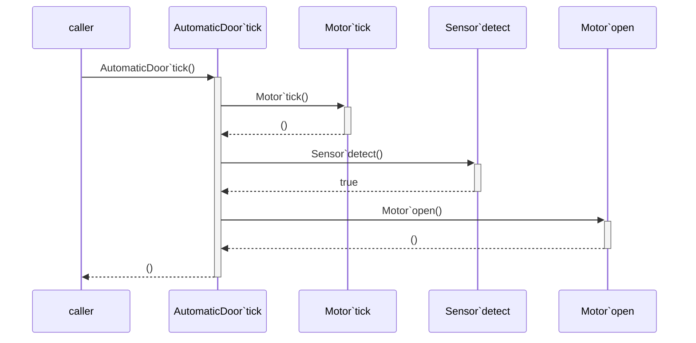
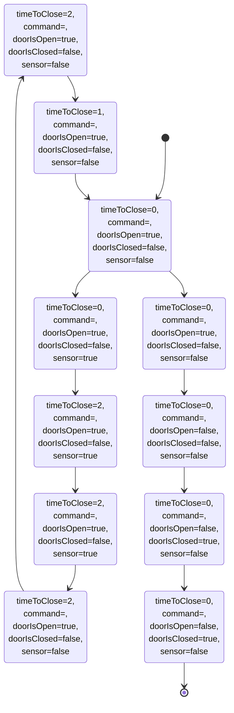

# NetMeeting 145

|||
|---|---|
| Deadline | 31 May 2025, 12:00 CEST |
| Participants | See git log |

## Review Status of the Action List

See [Net Meeting Actions](https://github.com/overturetool/overturetool.github.io/issues?q=is%3Aopen+is%3Aissue+label%3A%22action+net-meeting%22)

## Overture Language Board Status

## Status of ViennaTalk Development

In the dev branch of ViennaTalk, execution trace records the following events during animation.

* operation call statements and arguments
* return statements and return values
* single/multiple assignment statements and assigned values.

And generates the following diagrams from execution traces.

* Sequence Diagrams
* State Diagrams

Those diagrams can be exported as mermaid scripts like

##  Status of the Overture Components

#### VDMJ and VDM-VSCode

The 4.7.0-SNAPSHOT of VDMJ continues to be refined to handle operation POs, both in their generation and analysis via QuickCheck. The tools have been run over the example suite that is released with VDM-VSCode and numerous problems have been identified and are being fixed with those models.

A "patch" VDM-VSCode VSIX is occasionally released with the latest jars, to allow people to more easily try the latest functionality. The GUI has not been advanced for a year, and has fallen behind the language server slightly. This ought to be resolved before the next release.

##  Release Planning

#### VDM-VSCode

A release of VDM-VSCode that includes a released VDMJ 4.7.0 is long overdue. We need to do a little work on the POG GUI to display the latest information from the language server, but once that is done I think the release is ready to build and test.

##  Community Development

#### Overture Traffic

See download stats on [number of installs](https://marketplace.visualstudio.com/items?itemName=overturetool.vdm-vscode).

#### OVT-23

##  Publications Status and Plans

Also see [Planned Publications](https://www.overturetool.org/publications/PlannedPublications.html).

##  Any Other Business

