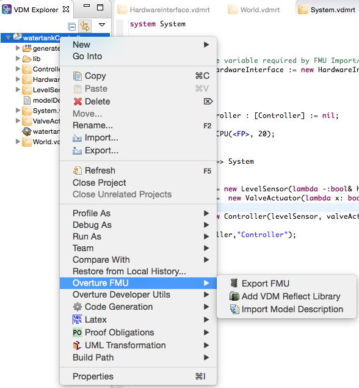
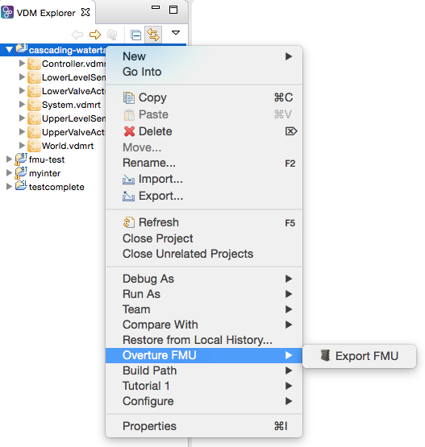
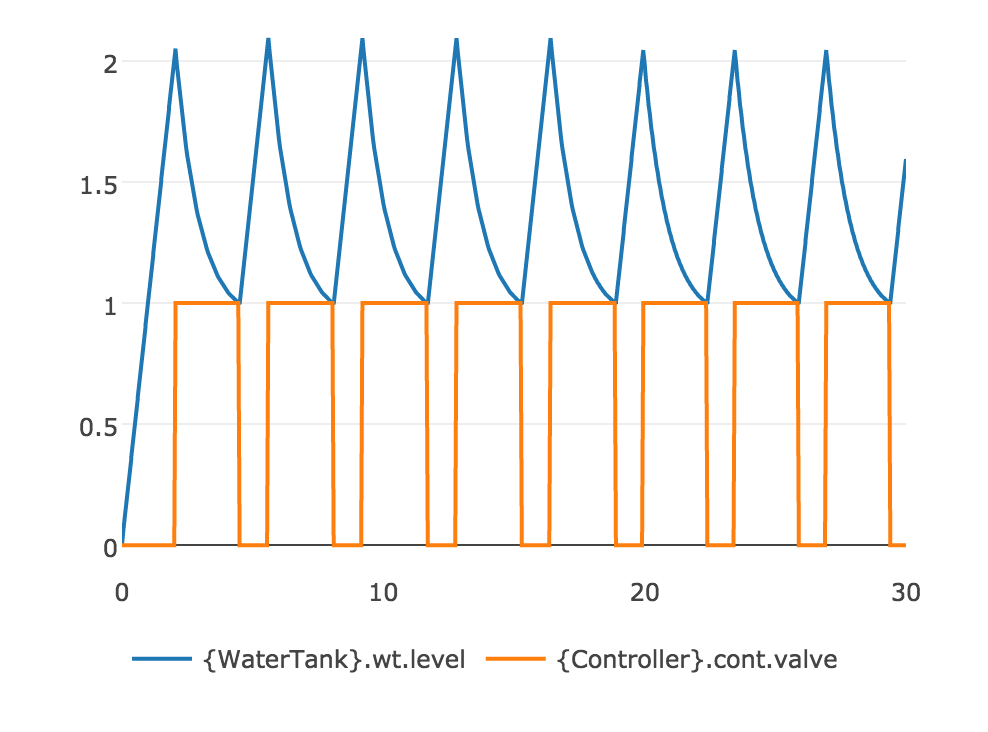

# FMI Support

The support for FMI in Overture is based on the Crescendo Tool and an automated export is avaliable when annotating the specification with FMI specific information.

The entry point used by the FMU wrapper is: `new World().run()` so make sure it is present on export.

* Note that FMUs running **VDM require variable step size**. If a fixed step size is selected then it may introduce errors. Thus if fixed stepsize is selected make sure that the interval is close to that of the control loop. (Internally VDM runs with nano seconds resolution where each expression is assigned a time cost)*

Overture (VDM) specification can be annotated with interface annotations allowing the modeller to specify which *values* should be *parameters*, and which *instance variables* should be *inputs* or *outputs*.

The annotation format is as follows:

```
-- @ interface: type = [input/output/parameter], name="...";
```
it must be located exactly above a value or instance variable, and it must be of one of the subclasses of `Port` from the FMI library.


## Installing the FMI Exporter for Overture

Open Overture and follow these steps:

- 1. Go to `Help->Install New Software...`
- 2. Click `Add...`
- 3. Enter:
 - Name: `Overture FMU`
 - Location: `http://overture.au.dk/into-cps/vdm-tool-wrapper/master/latest`
- 4. Click `Ok`
- 5. Check `Overture FMU Export`
- 6. Click Next / Finish follow the usual stuff to accept and install.

A snapshot build is avaliable from `http://overture.au.dk/into-cps/vdm-tool-wrapper/development/latest`

## Updating / Checking for new versions

- 1. Go to `Help->Installation Details
- 2. Select `Overture FMU Export`
- 3. Click `Update...`
- 4. Complete the wizard and restart

# Importing a `ModelDescription.xml` file

- 1. Right click on the project and select `Overture FMU->Import Model Description`




- 2. Select the model description file
- 3. Check the console for errors

If import is done on a clean project, the following files will be created:

- `System.vdmrt`
- `World.vdmrt`
- `HardwareInterface.vdmrt`

If these files already exist in the project, the `HardwareInterface.vdmrt` will be updated, the import will check for an instance thereof in the system and check for the `run` operation in `World`.


# Exporting an FMU

- 1. Right click on the project and select `Overture FMU->Export FMU`




The export will place a `.fmu` in the project folder on completion and list the export progress in the console as follows: 

```
---------------------------------------
|             FMU Export              |
---------------------------------------
Starting FMU export for project: 'watertankController'
Found annotated definition 'HardwareInterface.minlevel' with type 'parameter' and name 'minlevel'
Found annotated definition 'HardwareInterface.maxlevel' with type 'parameter' and name 'maxlevel'
Found annotated definition 'HardwareInterface.level' with type 'input' and name 'level'
Found annotated definition 'HardwareInterface.valveState' with type 'output' and name 'valveState'
Found system class: 'System'
Setting generation data to: 2016-04-26T15:36:08
```

This is followed by a printout of the `modelDescription.xml` file it generates.


# Annotations

### Parameter Annotations

A parameter annotation can only be used with VDM values as shown here: 

```
values
-- Hardware IO parameters aka - Shared Design Parameters
-- @ interface: type = parameter, name="maxlevel1";
public maxlevel1 : RealPort = new RealPort(2.0); -- {m}
```
The annotation can be used on any value in any class.

### Input & Output Annotations

An input or output annotation can only be used on instance variables in the `HardwareInterface` class as shown here:


```
system HardwareInterface

-- Hardware IO definitions
instance variables
	
-- @ interface: type = input, name="level1";
    public static upperlevel   : RealPort := new RealPort(0.0);
 
-- @ interface: type = output, name="valveState1";   
    public static upperValveState : BoolPort := BoolPort(false);
```


## Manual Export

See this page for [manual](overture.html) export.

## Example

The following example is a *WaterTank* controller that seeks to keep the water level in the tank between *min* and *max* by opening and closing a valve. It has a fixed inflow.

Extract from `modelDescription.xml`

```xml
<ScalarVariable name="minlevel" 
				valueReference="0" 
				causality="parameter" 
				variability="fixed" 
				initial="exact">
		<Real start="1.0" />
</ScalarVariable>

<ScalarVariable name="level" 
				valueReference="1" 
				causality="input" 
				variability="continuous">
		<Real start="0.0" />
</ScalarVariable>

<ScalarVariable name="maxlevel" 
				valueReference="2" 
				causality="parameter" 
				variability="fixed" 
				initial="exact">
		<Real start="2.0" />
</ScalarVariable>

<ScalarVariable name="valveState" 
				valueReference="3" 
				causality="output" 
				variability="discrete" 
				initial="calculated">
		<Boolean  />
</ScalarVariable>
```

The `HardwareInterface` as it will be imported or how it should be written manually. Note that the parameters (VDM values) could have been placed in other classes.

```
class HardwareInterface

values
	-- @ interface: type = parameter, name="minlevel";
	public minlevel : RealPort = new RealPort(1.0);
	-- @ interface: type = parameter, name="maxlevel";
	public maxlevel : RealPort = new RealPort(2.0);

instance variables
	-- @ interface: type = input, name="level";
	public level : RealPort := new RealPort(0.0);

instance variables
	-- @ interface: type = output, name="valveState";
	public valveState : BoolPort := new BoolPort(false);
	
end HardwareInterface
```

The `World` class, which is just used to start the model

```
class World

operations

public run : () ==> ()
run() ==
 (start(System`controller);
  block();
 );

private block : () ==>()
block() ==
  skip;

sync

  per block => false;

end World
```

The `system` has one special instance variable `hwi`.  This is used to auto link the FMI interface to the VDM model.

```
system System

instance variables

-- Hardware interface variable required by FMU Import/Export
public static hwi: HardwareInterface := new HardwareInterface();
    

instance variables

  public static controller : [Controller] := nil;

	cpu1 : CPU := new CPU(<FP>, 20);
operations

public System : () ==> System
System () == 
(
	let levelSensor   = new LevelSensor(hwi.level),
		 valveActuator =  new ValveActuator(hwi.valveState ) 
	in
		controller := new Controller(levelSensor, valveActuator);

	cpu1.deploy(controller,"Controller");
);

end System
```

The `LevelSensor` class has a port which it operates on.

```
class LevelSensor

instance variables

port : RealPort;

operations

public LevelSensor: RealPort ==> LevelSensor
LevelSensor(p) == port := p;

public getLevel: () ==> real
getLevel()==return port.getValue();

end LevelSensor
```

The `ValveActuator` class has a port it operates on.
```
class ValveActuator


instance variables

port : BoolPort;

operations

public ValveActuator: BoolPort ==> ValveActuator
ValveActuator(p) == port := p;

public setValve: bool ==> ()
setValve(value)==let - = handle(value) in skip;

end ValveActuator
```

Finally for completeness the `Controller`.

```
class Controller
  
instance variables

  levelSensor   : LevelSensor;
  valveActuator : ValveActuator;

operations

public Controller : LevelSensor * ValveActuator  ==> Controller
Controller(l,v)==
 (levelSensor   := l;
  valveActuator := v;
  );
  
values
open : bool = true;
close: bool = false;

operations

private loop : () ==>()
loop()==
	cycles(2)
   (
   
    let level : real = levelSensor.getLevel()
    in
    (
    
    if( level >= HardwareInterface`maxlevel.getValue())
    then valveActuator.setValve(open);
    
    if( level <= HardwareInterface`minlevel.getValue())
    then valveActuator.setValve(close);
    );
			
    
   );

thread
periodic(10E6,0,0,0)(loop);	 
		 
end Controller
```

Simulating this model from `0` to `30.0` with a variable step size algorithm should show similar to this: 




# FMI 2.0 Library for VDM

The FMI interface is modelled as a collection of VDM classes all deriving from the `Port` class:

```
/******************************************************************************************************************************
* FMI 2.0 interface for VDM
*
* The Port class is the base class for all ports. The following ports exists:
* - IntPort
* - BoolPort
* - RealPort
* - StringPort
* These concreate ports must be used in the HardwareInterface class. All of them must contain a private 'value' field
*  this field is accessed directly by the build-in FMI support in the simulator. The ports can be given as arguments to 
*  other model elements. All access to the internal value must be done through set/getValue since this call insured that the
*  simulator knows that the value have been read or written to and requires a co-simulation step for synchronization.
*
* A port can be instantiated with a value or with no values to use the library default value. 
*
******************************************************************************************************************************/

class Port

types
	public String = seq of char;
	public FmiPortType = bool | real | int | String;
 
operations

	public setValue : FmiPortType ==> ()
	setValue(v) == is subclass responsibility;

	public getValue : () ==> FmiPortType
	getValue() == is subclass responsibility;

	public static create: FmiPortType ==> IntPort | BoolPort | RealPort | StringPort
	create(v) ==
		if is_(v, String) then
			return new StringPort(v)
		elseif is_(v,bool) then
			return new BoolPort(v)
	 elseif is_(v,int) then
			return new IntPort(v)
	else
			return new RealPort(v)
			
end Port

class IntPort is subclass of Port

instance variables
	value: int:=0;

operations
	public IntPort: int ==> IntPort
	IntPort(v)==setValue(v);

	public setValue : int ==> ()
	setValue(v) ==value :=v;

	public getValue : () ==> int
	getValue() == return value;

end IntPort

class BoolPort is subclass of Port

instance variables
	value: bool:=false;

operations
	public BoolPort: bool ==> BoolPort
	BoolPort(v)==setValue(v);

	public setValue : bool ==> ()
	setValue(v) ==value :=v;

	public getValue : () ==> bool
	getValue() == return value;

end BoolPort

class RealPort is subclass of Port

instance variables
	value: real:=0.0;

operations
	public RealPort: real ==> RealPort
	RealPort(v)==setValue(v);

	public setValue : real ==> ()
	setValue(v) ==value :=v;

	public getValue : () ==> real
	getValue() == return value;

end RealPort

class StringPort is subclass of Port

instance variables
	value: String:="";

operations
	public StringPort: String ==> StringPort
	StringPort(v)==setValue(v);

	public setValue : String ==> ()
	setValue(v) ==value :=v;

	public getValue : () ==> String
	getValue() == return value;

end StringPort

```
